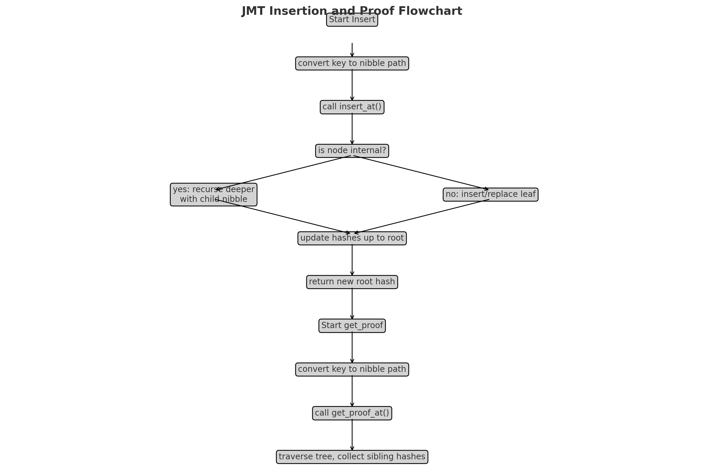

# Jellyfish Merkle Tree (JMT): Technical Overview & Proofs

## 📌 Introduction

The **Jellyfish Merkle Tree (JMT)** is a versioned, sparse Merkle tree designed for secure, efficient key-value storage with provable integrity.

✅ **Trie-based**: Patricia Trie-like structure, with nibble paths (4-bit) for keys  
✅ **Merkle property**: Each node has a cryptographic hash representing its subtree  
✅ **Versioned**: Supports immutable snapshots, enabling proofs of historical states  

---

## 🌳 Tree Structure

Each node in JMT can be:

1️⃣ **Internal Node**: maps nibble (0-15) to child node hash  
2️⃣ **Leaf Node**: holds a key-value pair  
3️⃣ **Empty Node**: implied in the sparse trie structure (not explicitly stored)  

### 🔎 Nibble Path

Given a key `k`:
- Compute its hash, e.g., `H(k)`.
- Convert `H(k)` to a sequence of nibbles: $n_0, n_1, \ldots, n_{63}$ (for 256-bit hash).

This defines a path from the root to the leaf in the JMT.

---

## 🔧 Insertion Flow

The process of inserting $(k, v)$ at version `v`:

1. Compute the nibble path of `H(k)`.
2. Start at the root.
3. For each nibble:
   - If child exists, recurse.
   - If missing, create internal/leaf nodes.
4. If there is a collision with an existing leaf:
   - **Split**: create an internal node at the divergence.
   - Place both leaves under this new internal node.
5. After reaching the leaf, update value.
6. Hash up:
   - Internal node:
     $$
     H_\text{Internal} = H(\text{version} \| \text{nibble\_map} \| \text{child\_hashes})
     $$
   - Leaf node:
     $$
     H_\text{Leaf} = H(\text{version} \| \text{key} \| \text{value})
     $$

---

## 🖼️ Diagram: Insertion Flowchart

---

## 🔍 Merkle Proofs

### Single Proof Generation

To prove that $(k, v)$ exists in a tree rooted at `root_hash`:

✅ Traverse the nibble path for `H(k)`  
✅ At each internal node, record sibling hashes not on the path  
✅ The proof consists of:
- Leaf data: $(k, v)$
- Sibling hashes along the path  

### Verification

1. Compute leaf hash:
$$
h_\text{leaf} = H(\text{version} \| \text{key} \| \text{value})
$$

2. For each level (bottom-up):
$$
h_\text{parent} = H(\text{version} \| \text{nibble\_map} \| \{\text{child\_hashes}\})
$$

3. Final reconstructed hash must equal the known `root_hash`.

---

## 🧮 Mathematical Proof of Correctness

The Merkle property ensures:

$$
\forall \text{ nodes } n, \quad h(n) = H(\text{node\_data} \| \text{children\_hashes})
$$

### Assumptions
- **Collision-resistant** hash function: no two different inputs produce the same hash
- Each internal node's hash uniquely represents its subtree

### Inclusion Proof
Given a proof for key `k` and value `v`, and a known root hash:
$$
\text{Verify that } \text{root\_hash} = \text{reconstructed\_hash}
$$

If any data is modified (e.g., `v` changes), the leaf hash changes, leading to a different final root hash and proof failure.

---

## ⚡ Multiproof Optimization

For multiple keys, a **multiproof** reuses shared internal nodes, reducing redundancy:

- Only unique sibling hashes are included
- Verification combines these into a minimal subtree reconstruction

---

## ✅ Key Advantages of JMT

- **Sparse Trie**: Only stores populated paths, saving space
- **Versioning**: Each update produces a new root hash, supporting history and light clients
- **Proof Compactness**: Proof size is logarithmic in tree depth (~64 for 256-bit keys)

---

## 📊 Summary Table

| Component        | Definition / Formula                                                      |
|------------------|----------------------------------------------------------------------------|
| Leaf Hash        | $H(\text{version} \| \text{key} \| \text{value})$                          |
| Internal Hash    | $H(\text{version} \| \text{nibble\_map} \| \{\text{child\_hashes}\})$      |
| Proof Includes   | Sibling hashes for each level, leaf data                                  |
| Correctness      | By Merkle property + collision resistance                                 |

---

## 🎯 Conclusion

The **Jellyfish Merkle Tree** elegantly combines:

- A **trie** for efficient path traversal
- A **Merkle tree** for secure state commitments
- **Versioning** for historical proofs

Its correctness is backed by the Merkle property: **If and only if** the sibling hashes and leaf data are valid, the root hash can be reconstructed.

---

### 📝 Notes for README

✅ Place the diagram image (`insertion_flowchart.png`) in the repo alongside the README.  
✅ Use a Markdown viewer that supports inline LaTeX equations (like GitHub or Jupyter) for best readability.  
✅ Let me know if you want to add more diagrams, interactive visualizations, or performance plots!

---
